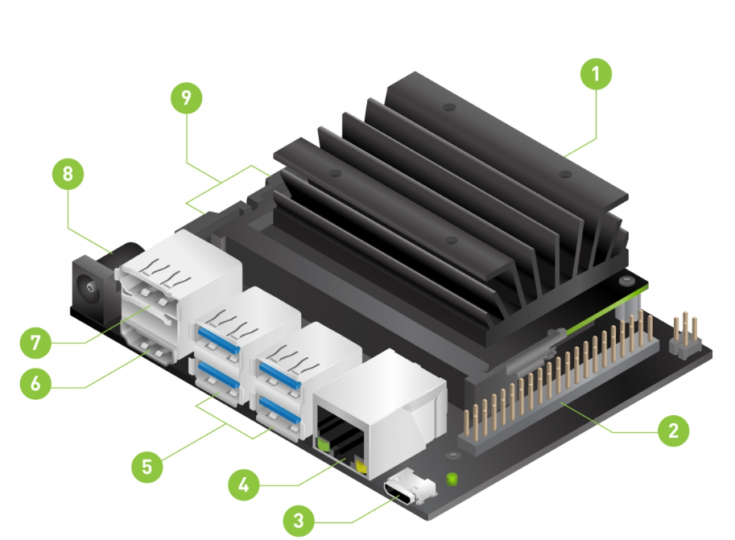
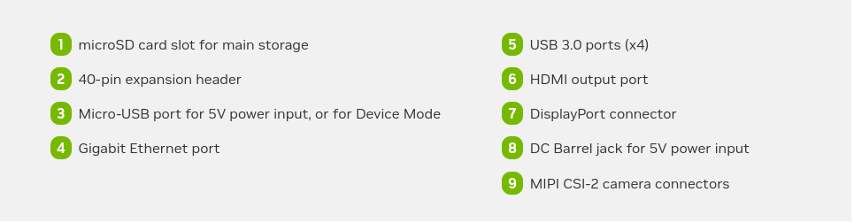
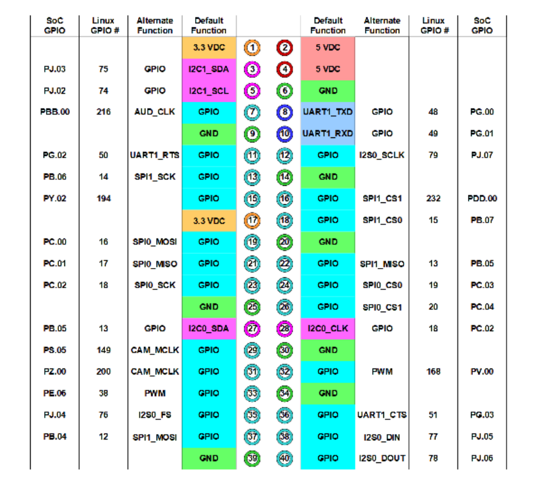
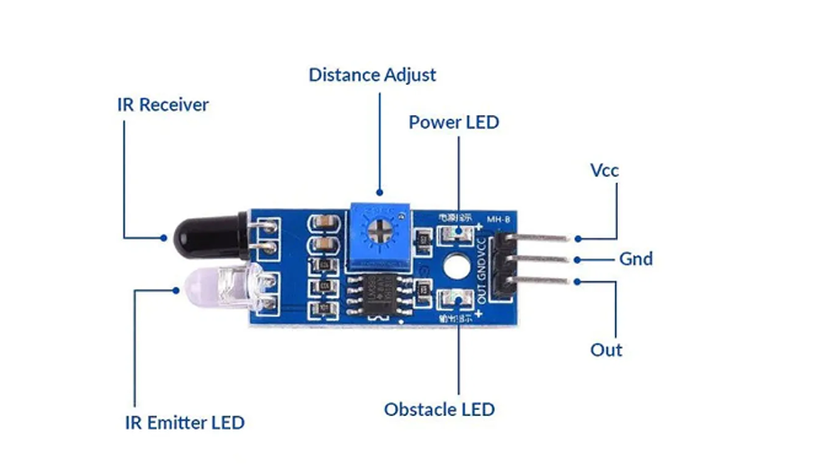

<h1 align="center">Intelligent Systems: Advanced Embedded AI for Real-World Problems</h1>

The whole trainig is done with the aid of jetson nano developer kit.
The NVIDIA® Jetson Nano™ Developer Kit is a small AI computer for makers, learners, and developers. After following along with this brief guide, you’ll be ready to start building practical AI applications, cool AI robots, and more.
[Read more about Jetson Nano developer kit](https://developer.nvidia.com/embedded/learn/get-started-jetson-nano-devkit)

# INDEX
- [Jetson Nano](#The-Jetson-Nano)
- [Basic programs using Jetson Nano](#Programs-using-Jetson-Nano)
- [Image Processing](#Image-processing)
- [MQTT](#MQTT-(Message-Queuing-Telemetry-Transport))

# The-Jetson-Nano
he Jetson Nano is a single-board computer (SBC) that includes GPU capabilities, making it a powerful tool for AI and machine learning applications





### Setting up Jetson Nano

- [Hardware requirements](#Hardware-Requirements)
- Downloading JetPack SDK (format SD card using gnome-disks)
- Flashing the SD card (Select Jetpack and Flash to SD Card using balena etcher)
- [Setting up the environment](#Set-up)

### Hardware-Requirements
• Power Supply
• HDMI Cable
• SD Card
• Monitor
• Mouse
• Keyboard

### Set-up
```BASH
sudo apt install python3-pip
pip3 install setuptools
sudo pip3 install -U jetson-stats
```


### Jetson Nano pin Diagram



# Programs-using-Jetson-Nano

- [Blinking LED Using Jetson Nano](#BLINKING-LED)
- [Accessing USB cameras](#ACCESS-CAMERAS)
- [IR sensor interfacing](#SENSOR-INTERFACING)


## BLINKING-LED
```PYTHON
 import Jetson.GPIO as GPIO
 import time

#pin definitions
 LED_PIN = 12# BCM pin is differnt form board pin

#pin - setup
 GPI0.setmode(GPIO.BOARD)# BCM pin-numbering scheme from Raspberry Pi
 GPIO.setup(LED_PIN, GPIO.OUT)#LED pin set as input

 while True:
    GPIO.output(LED_PIN, GPIO.HIGH)
    time.sleep(1)
    GPIO.output(LED_PIN, GPIO.LOW)
    time.sleep(1)
```

##

## ACCESS-CAMERAS
### USB camera configuration 
```BASH

sudo apt install v41-utils
v412-ctl --11st-devices
sudo apt-get install apt-utils
```

### Accessing the cameras

```PYTHON
import cv2
#Open the camera
ap = cv2.VideoCapture(0)
#Set the window name
window name = 'USB Camera'
# Loop over frames from the camera

while True:
    # Read a frame from the camera
    ret, frame = cap. read()
    # Check if the frame was successfully read
    if not ret:
        print( 'Error: could not read frame' )
        break
    # Display the frame in a window
    cv2. imshow(window_name, frame)
    # Wait for a key press
    if cv2.waitKey(1) & 0xFF == ord('q'):
        break   
```

# SENSOR-INTERFACING   

### Components of an IR sensor


### The code for detecting an object using IR sensor
```PYTHON
import RPi.GPIO as GPIO
import time

# Pin configuration
IR_SENSOR_PIN = 17  # GPIO17 (Pin 11)

# Setup GPIO
GPIO.setmode(GPIO.BCM)
GPIO.setup(IR_SENSOR_PIN, GPIO.IN)

# IR sensor function
def read_ir_sensor():
    if GPIO.input(IR_SENSOR_PIN) == GPIO.HIGH:
        return True  # Object detected
    else:
        return False  # No object detected

# Main loop
try:
    object_detected = False  # Initialize object detection status
    while True:
        current_state = read_ir_sensor()
        
        if current_state and not object_detected:
            print("Object detected!")
            object_detected = True
        elif not current_state and object_detected:
            print("Object not detected")
            object_detected = False
        
        time.sleep(0.1)  # Delay to avoid CPU load

except KeyboardInterrupt:
    print("Program terminated by user")

finally:
    GPIO.cleanup()
```

# Image-processing


Image processing is a field that involves using techniques and methods to enhance, analyze, and manipulate images. It includes tasks such as improving image quality through adjustments in brightness and contrast, transforming images by rotating or resizing, applying filters to highlight or reduce specific features, segmenting images to isolate objects or regions, and recognizing and classifying patterns or objects within images. These processes are used in various applications, including photography, medical imaging, and machine learning, to make images more useful and informative.

Image processing with python is done with the help of various libraries such as pillow, OpenCV, SimpleCV . We are gonna use OpenCV here.

 #### Install OpenCv
```PYTHON
pip install opencv-python
pip install numpy
```
#### Image and video capture

```PYTHON
import cv2
  
img = cv2.imread('unnamed.png')#the image which we need to process 
print(img)
cv2.imshow('title-of-theOpenCV-window',img)
cv2.waitKey()
cv2.destroyAllWindows()

```

```PYTHON
mport cv2
aptureobject
aptureobject
aptureobject
aptureobject
= cv2.VideoCapture( 'path-to-video' )
= cv2.VideoCapture(0)
VideoCapture( n)
= cv2.
= cv2.VideoCapture( )
```

To resize the image add the commad 
```PYTHON
resize_im = cv2.resize(img,(1200,400))
```

#### Some transformations of images 
```PYTHON
• Resizing: resized_img = cv2.resize(img, (new_width, new_height))
• Reading Images with Different Colors:
BGR : img = cv2.imread('path-to-image')
Gray Scale : gray_img = cv2.cvtColor(img, cv2.COLOR_BGR2GRAY)
• Flipping = cv2.flip(img, O)
• Inverting Images: invert_img = cv2.bitwise_not(img)
• Blurring Images:blur_img = cv2.blur(img, (kernel_width, kernel _ height))
• Dilation : dilated_img = cv2.dilate(img, (kernel_width, kernel_height))
• Erosion:eroded_img = cv2.erode(img, (kernel_width, kernel_height))
• Thresholding: var,threshold_image = cv2.threshold(gray_img,
threshold _ value, maximum_pixel_value, cv2.THRESH BINARY)
Edge Detection: img_edge = cv2.Canny(img, threshold_valuel,
threshold_value2)
• Saving Image: cv2.imwrite('path-to-save-the-image', img)
```
Example code for saving frames
```PYTHON

import cv2
vide00bject = cv2.VideoCapture(0)
while True:
    ret, frame = videoObject . read()
    if not ret:
        break
    cv2. imshow( 'Video' ,frame)
    cv2. imwrite( "path-to-save-frame/ f rame. jpg" ,frame)
    if cv2.waitKey(1) & 0xFF == ord( 'q' ) :
        break
videoObject . release()
cv2 . destroyAllIWindows()
```
Detecting object or movemnts in the screen and saving it to sysstem if the movement detected

```PYTHON
import cv2
import time
import os

# Initialize the camera
camera = cv2.VideoCapture(0)  # Use 0 for the default camera, adjust if using a different camera source

# Initialize variables for motion detection
first_frame = None
motion_detected = False

# Motion detection parameters
MIN_AREA = 20000  # Minimum area size for an object to be considered as motion (adjust as needed)
THRESHOLD_SENSITIVITY = 50  # Threshold sensitivity for motion detection (adjust as needed)
MOVEMENT_DURATION = 2.0  # Minimum duration of continuous movement to be considered as valid motion (adjust as needed)

# Initialize time for image capture delay
last_capture_time = time.time()
capture_interval = 2  # Interval in seconds between each image capture

# Create directory for saving images if it does not exist
save_dir = 'images'
if not os.path.exists(save_dir):
    os.makedirs(save_dir)

# Main loop
while True:
    # Capture frame-by-frame
    ret, frame = camera.read()
    
    # Convert frame to grayscale and blur it
    gray = cv2.cvtColor(frame, cv2.COLOR_BGR2GRAY)
    gray = cv2.GaussianBlur(gray, (21, 21), 0)
    
    # Initialize the first frame
    if first_frame is None:
        first_frame = gray
        continue
    
    # Compute absolute difference between the current frame and first frame
    frame_delta = cv2.absdiff(first_frame, gray)
    thresh = cv2.threshold(frame_delta, THRESHOLD_SENSITIVITY, 255, cv2.THRESH_BINARY)[1]
    
    # Dilate the thresholded image to fill in holes, then find contours
    thresh = cv2.dilate(thresh, None, iterations=2)
    contours, _ = cv2.findContours(thresh.copy(), cv2.RETR_EXTERNAL, cv2.CHAIN_APPROX_SIMPLE)
    
    # Check for motion
    motion_detected = False
    for contour in contours:
        if cv2.contourArea(contour) < MIN_AREA:
            continue
        
        # Calculate bounding box for the contour
        (x, y, w, h) = cv2.boundingRect(contour)
        
        # Draw bounding box around moving object (optional)
        cv2.rectangle(frame, (x, y), (x + w, y + h), (0, 255, 0), 2)
        
        # Check if enough time has passed since last capture
        current_time = time.time()
        if current_time - last_capture_time >= capture_interval:
            # Save the image when motion is detected
            timestamp = time.strftime("%Y%m%d_%H%M%S")
            filename = os.path.join(save_dir, f"motion_{timestamp}.jpg")
            cv2.imwrite(filename, frame)
            print(f"Motion detected! Image saved as {filename}")
            
            # Update last capture time
            last_capture_time = current_time
        
        # Set flag indicating motion is detected
        motion_detected = True
    
    # Display the frame
    cv2.imshow('Motion Detection', frame)
    
    # Wait for 'q' key to quit
    key = cv2.waitKey(1) & 0xFF
    if key == ord('q'):
        break

# Cleanup
camera.release()
cv2.destroyAllWindows()

```


# MQTT-(Message-Queuing-Telemetry-Transport)


#### Need for Messaging Protocols in IoT
• Challenges with device-to-device communication
• Importance of reliable and efficient message delivery
• Role of messaging protocols in IoT
#### MQTT Protocol
• Characteristics and advantages of MQTT
• MQTT architecture and components


### MQTT EXAMPLE

```BASH

pip3 install paho-mqtt
sudo apt install mosquitto mosquitto-clients
mosquitto_sub -h -t test
mosquitto_pub -h -t test -m "hello world"

```

```PYTHON

import Jetson.GPIO as GPIO
import time
import paho.mqtt.client as mqtt
LED_PIN = 11
GPIO.setmode(GPIO.BOARD)
GPIO.setup(LED_PIN,GPIO.OUT)

def on_message (client, userdata, message):
    if message.payload.decode ( ) == "on":
        GPIO.ouptput(11,GPIO.HIGH)
        print( "LED is on" )
    elif message.payload.decode( ) =="off " :
        GPIO.ouptput(11,GPIO.LOW)
        print ("LED is off")

client = mqtt.Client( )
client. connect( "localhost" ,1883,60)
client.subscribe ("led" )
client.on_message = on_message
client.loop_forever()

```

```PYTHON
import paho.mqtt.publish as publish
publish.single( "led" ,"on" ,hostname="192.168.29.237")
```


